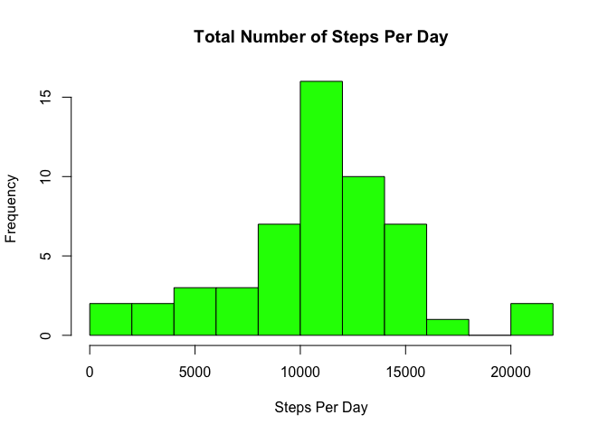
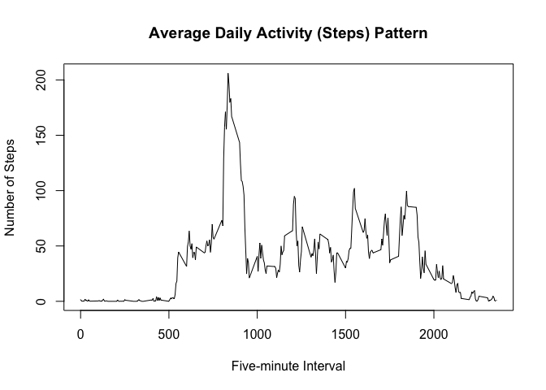
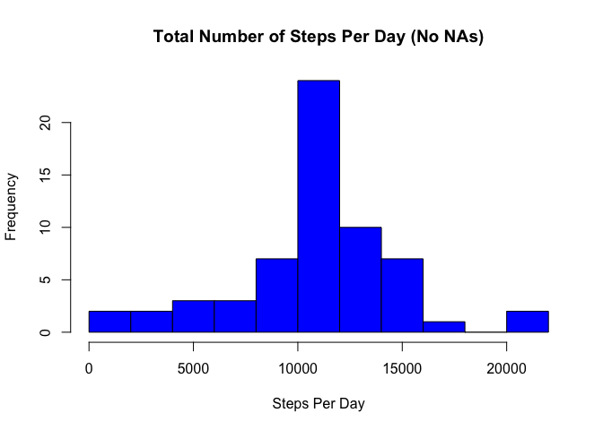
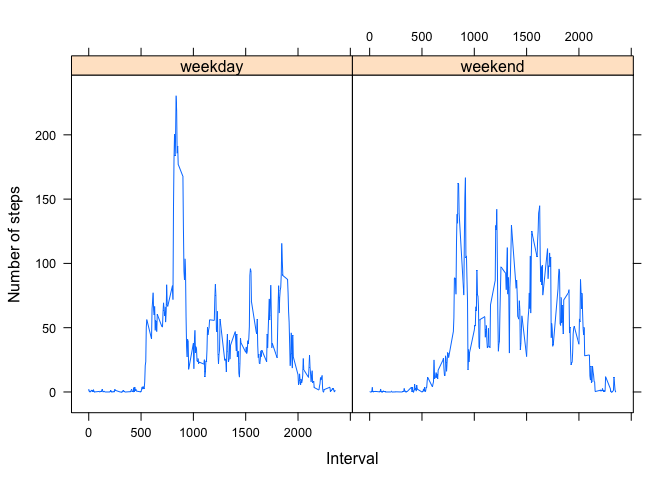

Introduction
============

It is now possible to collect a large amount of data about personal movement using activity monitoring devices such as a Fitbit, Nike Fuelband, or Jawbone Up. These type of devices are part of the “quantified self” movement – a group of enthusiasts who take measurements about themselves regularly to improve their health, to find patterns in their behavior, or because they are tech geeks. But these data remain under-utilized both because the raw data are hard to obtain and there is a lack of statistical methods and software for processing and interpreting the data.

This assignment makes use of data from a personal activity monitoring device. This device collects data at 5 minute intervals through out the day. The data consists of two months of data from an anonymous individual collected during the months of October and November, 2012 and include the number of steps taken in 5 minute intervals each day.

The data for this assignment can be downloaded from the course web site:

Dataset: [Activity monitoring data [52K]] The variables included in this dataset are:

steps: Number of steps taking in a 5-minute interval (missing values are coded as 𝙽𝙰) date: The date on which the measurement was taken in YYYY-MM-DD format interval: Identifier for the 5-minute interval in which measurement was taken The dataset is stored in a comma-separated-value (CSV) file and there are a total of 17,568 observations in this dataset.

Loading and preprocessing the data
----------------------------------

After placing the csv file in the current folder, we read it in R through the following command:

``` r
activity <- read.csv('activity.csv')
```

The mean total number of steps taken per day
--------------------------------------------

We first calculate the total number of steps taken per day. We will ignore the missing values for this part.

``` r
stepsPerDay <- aggregate(steps~date, data = activity, sum, na.action = na.omit)
stepsPerDay
```

    ##          date steps
    ## 1  2012-10-02   126
    ## 2  2012-10-03 11352
    ## 3  2012-10-04 12116
    ## 4  2012-10-05 13294
    ## 5  2012-10-06 15420
    ## 6  2012-10-07 11015
    ## 7  2012-10-09 12811
    ## 8  2012-10-10  9900
    ## 9  2012-10-11 10304
    ## 10 2012-10-12 17382
    ## 11 2012-10-13 12426
    ## 12 2012-10-14 15098
    ## 13 2012-10-15 10139
    ## 14 2012-10-16 15084
    ## 15 2012-10-17 13452
    ## 16 2012-10-18 10056
    ## 17 2012-10-19 11829
    ## 18 2012-10-20 10395
    ## 19 2012-10-21  8821
    ## 20 2012-10-22 13460
    ## 21 2012-10-23  8918
    ## 22 2012-10-24  8355
    ## 23 2012-10-25  2492
    ## 24 2012-10-26  6778
    ## 25 2012-10-27 10119
    ## 26 2012-10-28 11458
    ## 27 2012-10-29  5018
    ## 28 2012-10-30  9819
    ## 29 2012-10-31 15414
    ## 30 2012-11-02 10600
    ## 31 2012-11-03 10571
    ## 32 2012-11-05 10439
    ## 33 2012-11-06  8334
    ## 34 2012-11-07 12883
    ## 35 2012-11-08  3219
    ## 36 2012-11-11 12608
    ## 37 2012-11-12 10765
    ## 38 2012-11-13  7336
    ## 39 2012-11-15    41
    ## 40 2012-11-16  5441
    ## 41 2012-11-17 14339
    ## 42 2012-11-18 15110
    ## 43 2012-11-19  8841
    ## 44 2012-11-20  4472
    ## 45 2012-11-21 12787
    ## 46 2012-11-22 20427
    ## 47 2012-11-23 21194
    ## 48 2012-11-24 14478
    ## 49 2012-11-25 11834
    ## 50 2012-11-26 11162
    ## 51 2012-11-27 13646
    ## 52 2012-11-28 10183
    ## 53 2012-11-29  7047

Then we make a histogram of the total number of steps taken each day.

``` r
hist(stepsPerDay$steps, breaks = 10, main = "Total Number of Steps Per Day", xlab = "Steps Per Day", col = 'green')
```



We can easily calculate the mean (and median) total number of steps taken per day:

``` r
meanStepsPerDay <- mean(stepsPerDay$steps)
medianStepsPerDay <- median(stepsPerDay$steps)
options(scipen = 999)
```

Note that we used the options function here to suppress the scientific notation. It turns out that the mean and median total number of steps taken per day are `meanStepsPerDay =`10766.19 and `medianStepsPerDay =`10765 respectively.

The average daily activity pattern
----------------------------------

To understand the average daily activity (steps) pattern, we make a time series plot of the 5-minute interval (x-axis) and the average number of steps taken, averaged across all days (y-axis).

``` r
avgStepsPerInterval <- aggregate(steps~interval, data = activity, mean, na.action = na.omit)
with(avgStepsPerInterval, plot(interval, steps, , type = 'l', xlab = "Five-minute Interval", ylab = "Number of Steps", main = "Average Daily Activity (Steps) Pattern"))
```



We can easily find that particular 5-minute interval which contains the maximum number of steps, averaged across the two month period.

``` r
maxStepsInterval <- with(avgStepsPerInterval, interval[steps == max(steps)])
maxStepsInterval
```

    ## [1] 835

We see that the 5-minute interval after 835 th minute in a day i.e. during the interval of time 1:55 pm to 2 pm has the maximum number of steps, on the average.

Imputing missing values
-----------------------

Note that there are a number of days/intervals where there are missing values (coded as 𝙽𝙰). The presence of missing days may introduce bias into some calculations or summaries of the data. Let's calculate and report the total number of missing values in the dataset (i.e. the total number of rows with 𝙽𝙰s).

``` r
vectorNAs <- !complete.cases(activity)
numberOfNAs <- sum(vectorNAs)
numberOfNAs
```

    ## [1] 2304

We see that the total number of missing values in the dataset (i.e. the total number of rows with NAs) is 2304. So, we would like to replace those NA's with some suitable values so that it does not distort the essence of what the data is trying to tell. In particular, we would like to replace those NA's with the mean for that corresponding 5-minute interval.

``` r
activityWithNoNA <- activity
for(i in seq(dim(activityWithNoNA)[1])){
    if(is.na(activityWithNoNA$steps[i]))
        activityWithNoNA$steps[i] <-  avgStepsPerInterval$steps[avgStepsPerInterval$interval == activityWithNoNA$interval[i]]
}
```

Here, the new dataset **activityWithNoNA** is equal to the original dataset 'activity' but with the missing data filled in.

Next, we calculate the mean total number of steps taken per day on this new dataset *activityWithNoNA* and compare with the same on the old data set **activity**. The following piece of code calculates the total number of steps taken per day, draws the corresponding histogram and finally calculates the mean and median total number of steps taken per day on this new dataset *activityWithNoNA*.

``` r
stepsPerDay_NoNA <- aggregate(steps~date, data = activityWithNoNA, sum)
hist(stepsPerDay_NoNA$steps, breaks = 10, main = "Total Number of Steps Per Day (No NAs)", xlab = "Steps Per Day", col = 'blue')
```



``` r
meanStepsPerDay_NoNA <- mean(stepsPerDay_NoNA$steps)
medianStepsPerDay_NoNA <- median(stepsPerDay_NoNA$steps)
meanStepsPerDay_NoNA
```

    ## [1] 10766.19

``` r
medianStepsPerDay_NoNA
```

    ## [1] 10766.19

It is clear that when the NAs are imputed in the original data to form a new dataset 'activityWithNoNA', the mean and median total number of steps taken per day both found to be equal to 10766.1886792 which is same as the corresponding mean 10766.1886792 for the original data. Moreover, we observe higher spike for the tallest bar in the histogram (reaching out to be more than 20 in frequency). Further, the new historgram seems to be more symmetrical than the original one (no wonder why the mean and median both are same this time.)

Are there differences in activity patterns between weekdays and weekends?
-------------------------------------------------------------------------

We analayze the average daily activity (steps) pattern during the weekdays and weekends. There is a reasonable ground to believe that such patterns should be different during weekdays and weekends. First, we create a new factor variable in the dataset with two levels – “weekday” and “weekend” indicating whether a given date is a weekday or weekend day. The following piece of code does the job.

``` r
weekEnd <- c("Saturday","Sunday")
activityWithNoNA$weekDayOrEnd <- factor(ifelse(weekdays(as.Date(activityWithNoNA$date)) %in% weekEnd, "weekend","weekday"))
```

The comparision between the activity pattern can be done using a panel plot of a time series plot of the 5-minute interval (x-axis) and the average number of steps taken, averaged across all weekday days or weekend days (y-axis).

``` r
avgStepsPerInterval_weekDayOrEnd <- aggregate(steps~weekDayOrEnd+interval, data = activityWithNoNA, mean)
#library(ggplot2)
#qplot(interval, steps, data = avgStepsPerInterval_weekDayOrEnd, geom = 'line',facets = weekDayOrEnd~.)
library(lattice)
xyplot(steps~interval|weekDayOrEnd, data = avgStepsPerInterval_weekDayOrEnd, type = "l", xlab = "Interval", ylab = "Number of steps")
```


